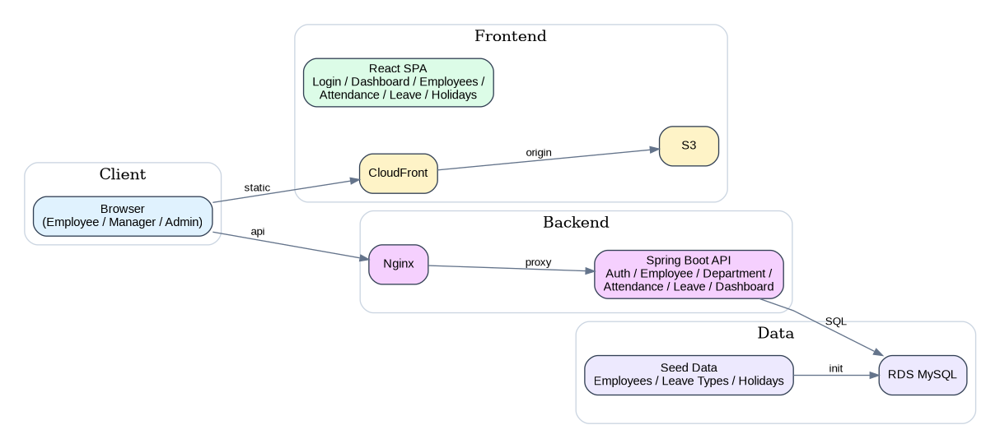
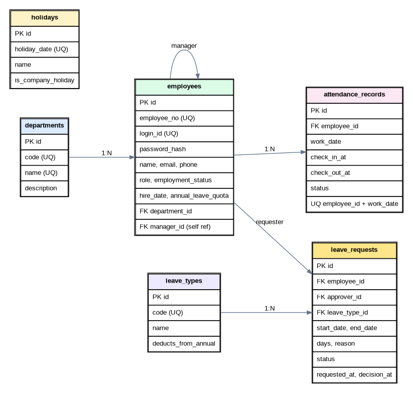

## 1. 이 프로젝트에서 만들 것

### 핵심 범위(MVP)
- 로그인 / 내 정보 조회
- 직원 / 부서 관리
- 출근 / 퇴근 처리
- 근태 월간 조회
- 휴가 신청 / 승인 / 반려 / 취소
- 내 대시보드 / 팀 대시보드
- 공휴일 관리
- React + Spring Boot + AWS 배포

### 이번 프로젝트에서 **확장 포인트** 
- 급여(Payroll)
- 전자결재 전체 모듈
- 조직도 드래그 편집
- 평가/성과 관리
- 메일/Slack 알림 자동화
- 리프레시 토큰 / SSO / 사내 메신저 연동

---

## 2. 권장 문서 읽는 순서

1. [01-project-brief.md](./01-project-brief.md)
2. [02-domain-guide.md](./02-domain-guide.md)
3. [03-feature-scope-and-logic.md](./03-feature-scope-and-logic.md)
4. [04-erd-and-db-schema.md](./04-erd-and-db-schema.md)
5. [05-api-spec.md](./05-api-spec.md)
6. [07-team-plan-and-timeline.md](./07-team-plan-and-timeline.md)
7. [06-deployment-guide.md](./06-deployment-guide.md)
8. [08-testing-checklist.md](./08-testing-checklist.md)

---

## 3. 문서 구성

| 파일 | 목적 |
|---|---|
| 01-project-brief.md | 프로젝트 배경, 목표, 사용자, 범위, 화면 구조 |
| 02-domain-guide.md | HR 도메인 기본 개념 설명 |
| 03-feature-scope-and-logic.md | 필수 기능, 핵심 로직, 확장 포인트 |
| 04-erd-and-db-schema.md | ERD, 테이블 설명, 제약조건, 인덱스 |
| 05-api-spec.md | REST API 명세, 요청/응답 예시, 에러 코드 |
| 06-deployment-guide.md | AWS 배포 구조와 체크리스트 |
| 07-team-plan-and-timeline.md | 역할 분담, 일정, 개발 순서 |
| 08-testing-checklist.md | 테스트 시나리오, 수동 점검 항목 |
| openapi/hr-system-openapi.yaml | Swagger Editor/Swagger UI용 OpenAPI 스펙 |
| sql/schema.sql | MySQL 8 기준 DDL |
| sql/seed.sql | 샘플 데이터 |
| postman/hr-system.postman_collection.json | Postman 컬렉션 |

---

## 4. 프로젝트 기본 방향

- **프로젝트명:** HR Core Lite
- **대상 사용자:** 사내 직원, 팀장/매니저, HR 관리자
- **프론트엔드:** React (Vite), React Router, TanStack Query
- **백엔드:** Spring Boot, Spring Security, JPA
- **DB:** MySQL 8
- **배포:** S3 + CloudFront(프론트), EC2 + Nginx + Spring Boot(백엔드), RDS(MySQL)

---

## 5. 시작 전에 꼭 합의할 것

- 이번 프로젝트의 핵심 범위는 **인사 + 근태 + 휴가 승인**까지
- 급여는 구현하지 않음
- **API와 ERD를 먼저 확정**하고 개발 시작
- 모든 화면은 아래 흐름이 실제로 끝까지 동작해야 함

### 반드시 데모 가능한 흐름
1. 직원 로그인
2. 출근 버튼 클릭
3. 휴가 신청
4. 매니저 로그인 후 승인
5. 대시보드 / 목록에 반영
6. AWS 배포 주소에서 동작 확인

---

## 6. 핵심 화면(디자인 기준으로 연결)

- 로그인
- 내 대시보드
- 직원 목록 / 직원 상세
- 부서 관리
- 내 근태 조회
- 휴가 신청 / 내 신청 목록
- 승인 대기 목록
- 공휴일 관리

---

## 7. 추천 폴더 구조

```text
frontend/
  src/
    api/
    pages/
      auth/
      employees/
      departments/
      attendance/
      leave/
      dashboard/
      holidays/
    components/
    hooks/
    query/
    store/

backend/
  src/main/java/com/example/hr/
    global/
    auth/
    employee/
    department/
    attendance/
    leave/
    holiday/
    dashboard/
```

---

## 8. 권장 구현 우선순위

1. 인증 / 공통 응답 형식
2. 부서 / 직원 CRUD
3. 출근 / 퇴근 / 근태 조회
4. 휴가 신청 / 승인
5. 대시보드
6. 권한 제어
7. 배포
8. 테스트 / 발표 준비

---

## 9. 이미지

### 시스템 개요


### ERD
